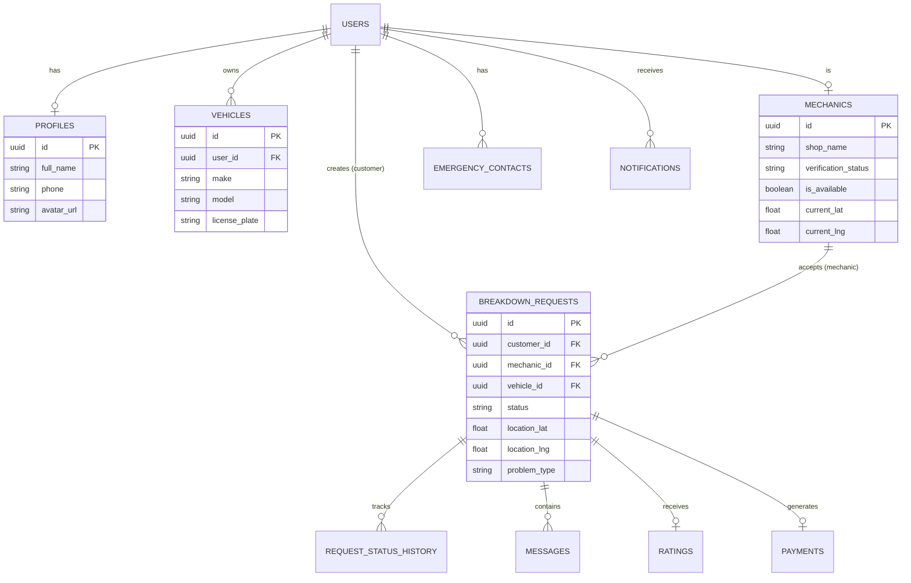

# On-Road Vehicle Breakdown Assistance System - Implementation Plan

## Goal Description
Develop a production-ready, highly scalable, and modern web application that connects vehicle owners with nearby mechanics in real time during breakdowns. The platform will feature a premium, mobile-first design and leverage a modern Next.js + Supabase stack.

> [!IMPORTANT]
> **User Review Required**
> Please review the comprehensive specifications below. Implementation (Phase 6 onwards) will only begin once you approve this plan. Let me know if any adjustments are needed to the Database Schema, Folder Structure, or UI/UX directions before we proceed with the actual code generation.

---

## 1. Software Requirement Specification (SRS)
**Project Title**: On-Road Vehicle Breakdown Assistance System
**Objective**: To provide a seamless, Uber-like experience for roadside assistance, bridging the gap between stranded drivers and local mechanics. 
**Target Audience**:
- **Customers**: Everyday vehicle owners and drivers.
- **Mechanics**: Independent mechanics and towing service providers.
- **Admins**: Platform operators managing quality, disputes, and analytics.

---

## 2. Functional Requirements
### Customer Features
- **Auth & Profile**: Register, Login (Email/Google), Profile Management, Emergency Contacts.
- **Vehicle Management**: Add and manage multiple vehicles.
- **Breakdown Request**: Select issue type, capture live GPS location, upload images, add descriptions.
- **Real-Time Tracking**: Instantly see mechanic acceptance, track mechanic location on a map, view ETA.
- **Communication**: Real-time chat and call integration with the assigned mechanic.
- **Post-Service**: View service history, download invoices, rate mechanics, and submit feedback.

### Mechanic Features
- **Auth & Onboarding**: Register, complete profile, upload shop info, and verification documents.
- **Status**: Toggle availability (Online/Offline).
- **Request Management**: Receive nearby requests in real-time, accept/reject requests.
- **Navigation & Execution**: View live navigation to customer, update job status (En Route, Arrived, In Progress, Completed).
- **Analytics**: View earnings, ratings, and job history.

### Admin Dashboard
- **Overview**: High-level metrics, active requests, total revenue, user counts.
- **User Management**: Manage Customers and Mechanics (approve verifications).
- **Request Management**: Monitor active and past requests, handle disputes.
- **System Settings**: Application configuration, feedback management.

---

## 3. Non-Functional Requirements
- **Scalability**: Must handle concurrent real-time connections efficiently (Supabase Realtime).
- **Performance**: Edge-optimized routing via Next.js; instantaneous UI updates with optimistic rendering.
- **Security**: Role-Level Security (RLS) in PostgreSQL, robust Next.js middleware for protected routes, strict input validation using Zod.
- **UX/UI**: Mobile-first responsiveness, smooth micro-interactions (Framer Motion), loading skeletons, and a premium "glassmorphic" aesthetic.
- **Availability**: Deployed on Vercel for high availability and automatic scaling.

---

## 4. User Roles
1. **Customer**: End-user seeking assistance.
2. **Mechanic**: Service provider offering assistance.
3. **Admin**: System manager overseeing the entire ecosystem.

---

## 5. User Flow (Breakdown Request)
1. **Customer** logs in and clicks "Request Assistance".
2. Chooses the problem (Flat Tyre, Dead Battery, Engine Failure, etc.).
3. Captures GPS location, uploads vehicle image, writes a short description, and submits.
4. **Supabase** stores the request and triggers a Realtime event.
5. Nearby **Mechanics** receive an instant notification.
6. A **Mechanic** accepts the request.
7. **Customer** is instantly notified of the acceptance.
8. Live tracking and chat begin.
9. **Mechanic** reaches the destination and completes the repair.
10. Payment (optional workflow) is processed.
11. **Customer** rates the mechanic and history is saved.

---

## 6. System Architecture
- **Frontend Core**: Next.js 15+ (App Router), React, TypeScript.
- **Styling**: Tailwind CSS, Shadcn UI, Framer Motion, Lucide Icons.
- **Forms & Validation**: React Hook Form, Zod.
- **Backend Logic**: Next.js Server Actions and Route Handlers.
- **Database & Auth**: Supabase (PostgreSQL, Supabase Auth).
- **Storage**: Supabase Storage (images/documents).
- **Realtime**: Supabase Realtime channels.
- **Maps**: Leaflet + OpenStreetMap (React Leaflet).
- **Hosting**: Vercel.

---

## 7. Folder Structure
```text
/ (Project Root)
├── app/
│   ├── (auth)/             # Login, Register, Forgot Password
│   ├── (dashboard)/
│   │   ├── admin/          # Admin routes
│   │   ├── customer/       # Customer routes
│   │   └── mechanic/       # Mechanic routes
│   ├── api/                # Next.js Route Handlers
│   ├── globals.css         # Tailwind and base styles
│   └── layout.tsx          # Root layout
├── components/
│   ├── ui/                 # Shadcn UI components
│   ├── forms/              # Reusable form components
│   ├── maps/               # Leaflet map components
│   └── shared/             # Headers, Footers, Sidebars
├── features/               # Domain-specific logic (e.g., breakdown-request, chat)
├── hooks/                  # Custom React hooks (e.g., useGeolocation, useRealtime)
├── lib/                    # Utility libraries (e.g., supabase client, utils)
├── services/               # External service integrations
├── supabase/               # Database migrations and types
├── types/                  # Global TypeScript definitions
├── utils/                  # Helper functions
├── middleware.ts           # Route protection and role-based redirects
├── context/                # React Context providers (Auth, Theme)
├── constants/              # Application constants (Enums, Config)
└── public/                 # Static assets (images, icons)
```

---

## 8. Database Schema

- **users**: `id`, `email`, `role`, `created_at`
- **profiles**: `id` (refs users), `full_name`, `phone`, `avatar_url`, `updated_at`
- **vehicles**: `id`, `user_id`, `make`, `model`, `year`, `license_plate`, `color`
- **mechanics**: `id` (refs users), `shop_name`, `verification_status`, `is_available`, `current_lat`, `current_lng`, `documents_url`
- **breakdown_requests**: `id`, `customer_id`, `mechanic_id` (nullable), `problem_type`, `description`, `location_lat`, `location_lng`, `status` (pending, accepted, en_route, in_progress, completed, cancelled), `vehicle_id`, `image_url`, `created_at`
- **request_status_history**: `id`, `request_id`, `status`, `changed_by`, `created_at`
- **notifications**: `id`, `user_id`, `title`, `message`, `is_read`, `created_at`
- **messages**: `id`, `request_id`, `sender_id`, `content`, `created_at`
- **ratings**: `id`, `request_id`, `customer_id`, `mechanic_id`, `rating`, `review`, `created_at`
- **payments**: `id`, `request_id`, `amount`, `status`, `method`, `created_at`
- **service_history**: View/table aggregating completed requests for users.
- **emergency_contacts**: `id`, `user_id`, `name`, `phone`, `relation`

---

## 9. ER Diagram



---

## 10. API Design (Next.js Server Actions / Route Handlers)
Most data mutations will be handled via **Next.js Server Actions** for seamless type safety and progressive enhancement.
- `createBreakdownRequest(data)`
- `acceptRequest(requestId, mechanicId)`
- `updateRequestStatus(requestId, status)`
- `sendMessage(requestId, content)`
- `updateMechanicLocation(lat, lng)`

For webhooks or third-party integrations, we will use **Route Handlers** (e.g., `/api/webhooks/payment`).

---

## 11. Project Roadmap
- **Phase 1-5**: Planning, Architecture, Schema, ER Diagram, Folder Structure *(Currently in review)*
- **Phase 6**: Supabase Setup (Database initialization, RLS policies, Types generation)
- **Phase 7**: Authentication (Supabase Auth + Middleware + Roles)
- **Phase 8**: Landing Page (Hero, Features, Testimonials, Framer Motion animations)
- **Phase 9**: Customer Module (Dashboard, Vehicle Management, Request flow)
- **Phase 10**: Mechanic Module (Dashboard, Onboarding, Live Location)
- **Phase 11**: Admin Dashboard (Analytics, User Approvals)
- **Phase 12**: Realtime Features (Supabase Subscriptions for Requests)
- **Phase 13**: Maps Integration (Leaflet routing, Custom Markers)
- **Phase 14**: Chat System (Realtime messaging within requests)
- **Phase 15**: Notifications (Toast notifications, Push/In-app)
- **Phase 16**: Testing (Unit/E2E considerations)
- **Phase 17**: Final Deployment on Vercel

---

## 12. UI Design Plan
- **Aesthetic**: Premium SaaS look, inspired by Uber/Stripe/Vercel. Dark mode support with sleek, glassmorphic elements and soft glows.
- **Colors**: Deep slate/zinc for dark mode, pure white/off-white for light mode, with a vibrant primary accent color (e.g., electric blue or emerald green).
- **Typography**: `Inter` or `Outfit` via Google Fonts.
- **Interactions**: Subtle hover states, smooth page transitions (Framer Motion), Skeleton loaders for async operations to prevent layout shift.

---

## 13. Deployment Plan
- **Platform**: Vercel
- **Environment Variables**: Supabase URL, Anon Key, Service Role Key (for admin tasks), Map API configurations.
- **CI/CD**: Automatic branch preview deployments on Vercel, with strict TypeScript and ESLint checks before production merge.

---

> [!TIP]
> **Next Steps**
> If you approve this plan, I will proceed to **Phase 6 & 7**: initializing the Next.js project, setting up the Supabase configuration, generating the database schema/types, and building the complete Authentication flow.
